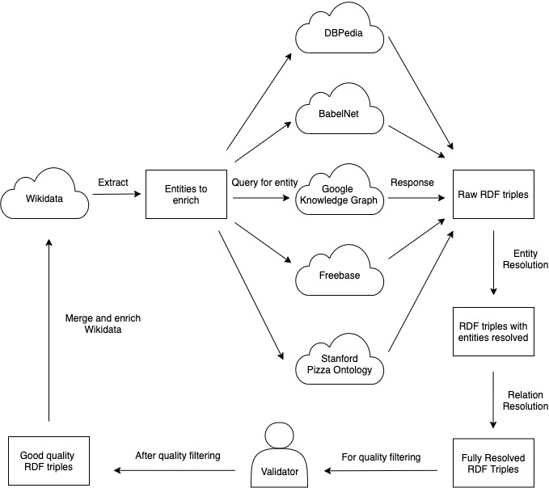

# README 

This repository contains the entire codebase to extracting entites from different Knowledge 
Graphs including Freebase, DBPedia, BabelNet, Google KG and Stanford Pizza Ontology.

The Wikidata Enrichment pipeline is as follows:

## Directory Structure

1. `enricher`: This directory contains the various code scripts required to perform KG extraction and disambiguation
2. `workbench`: This directory contains the validation workbench to facilitate crowdsourced validation of relations extracted from Wikidata, before merging them. 

Check the READMEs in the individual directories for further instructions on how to run the script files.